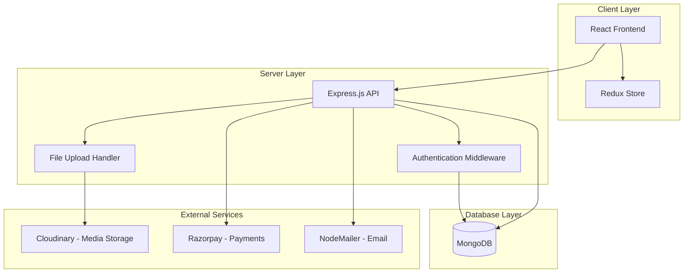
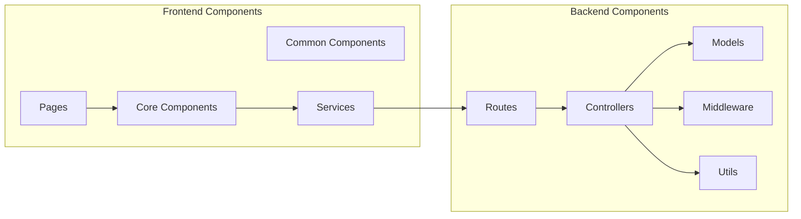
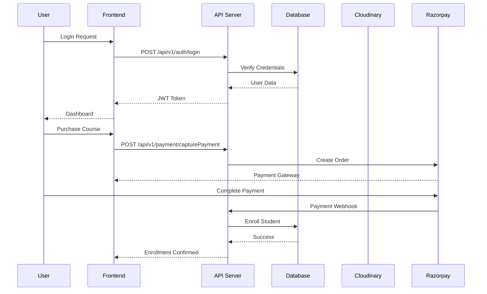
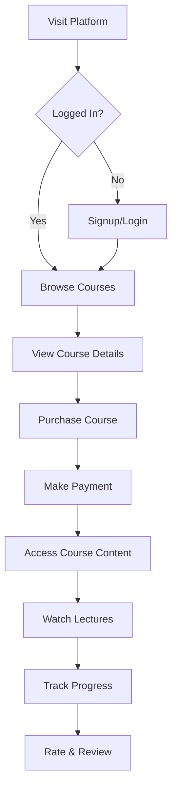
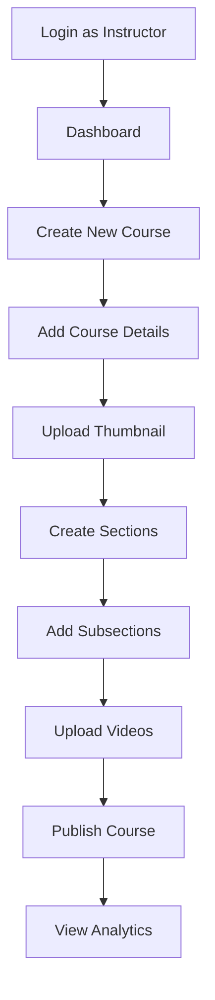

# 📚 StudyNotion - EdTech Platform

[](https://reactjs.org/)
[](https://nodejs.org/)
[](https://www.mongodb.com/)
[](https://tailwindcss.com/)

A full-stack EdTech (Educational Technology) platform that enables users to create, consume, and rate educational content. Built with the MERN stack (MongoDB, Express.js, React, Node.js).


[](https://github.com/Raushancreation1/StudyNotion-pro)

---

## 📋 Table of Contents

- [Features](#-features)
- [System Architecture](#-system-architecture)
- [Tech Stack](#-tech-stack)
- [Installation](#-installation)
- [Usage](#-usage)
- [API Documentation](#-api-documentation)
- [Project Structure](#-project-structure)
- [Contributing](#-contributing)

---

## ✨ Features

### 👨‍🎓 For Students
- **User Authentication**: Secure signup/login with OTP verification
- **Course Catalog**: Browse and search courses by category
- **Course Purchase**: Integrated Razorpay payment gateway
- **Course Progress Tracking**: Track your learning journey
- **Video Player**: Watch course lectures with a custom video player
- **Rating & Reviews**: Rate and review courses
- **Profile Management**: Update profile, change password

### 👨‍🏫 For Instructors
- **Course Creation**: Create courses with sections and subsections
- **Rich Text Editor**: Create engaging course content
- **Media Upload**: Upload thumbnails and videos via Cloudinary
- **Course Management**: Edit, delete, and manage your courses
- **Analytics Dashboard**: View course statistics and earnings
- **Student Insights**: Track student enrollments and performance

### 🔐 Admin Features
- **Category Management**: Create and manage course categories
- **User Management**: Monitor and manage user accounts
- **Platform Analytics**: Overview of platform performance

---

## 🏗️ System Architecture

### High-Level Architecture



### Component Architecture



### Data Flow Diagram



---

## 🛠️ Tech Stack

### Frontend
| Technology | Purpose |
|-----------|---------|
| **React 18.2** | UI Framework |
| **Redux Toolkit** | State Management |
| **React Router** | Client-side Routing |
| **Tailwind CSS** | Styling |
| **Axios** | HTTP Client |
| **React Hook Form** | Form Management |
| **Chart.js** | Data Visualization |
| **Swiper** | Carousel/Slider |
| **React Hot Toast** | Notifications |

### Backend
| Technology | Purpose |
|-----------|---------|
| **Node.js** | Runtime Environment |
| **Express.js** | Web Framework |
| **MongoDB** | Database |
| **Mongoose** | ODM (Object Data Modeling) |
| **JWT** | Authentication |
| **Bcrypt** | Password Hashing |
| **Cloudinary** | Media Storage |
| **Razorpay** | Payment Gateway |
| **NodeMailer** | Email Service |

---

## 📦 Installation

### Prerequisites
- Node.js (v14 or higher)
- MongoDB (local or cloud)
- npm or yarn
- Git

### Clone Repository
```bash
git clone https://github.com/Raushancreation1/StudyNotion-pro.git
cd StudyNotion-pro
```

### Backend Setup

1. **Navigate to server directory**
   ```bash
   cd server
   ```

2. **Install dependencies**
   ```bash
   npm install
   ```

3. **Create `.env` file**
   ```env
   # Database
   MONGODB_URL=your_mongodb_connection_string
   
   # Server
   PORT=5000
   
   # JWT
   JWT_SECRET=your_jwt_secret_key
   
   # Cloudinary
   CLOUD_NAME=your_cloudinary_cloud_name
   CLOUDINARY_API_KEY=your_cloudinary_api_key
   CLOUDINARY_API_SECRET=your_cloudinary_api_secret
   
   # Razorpay
   RAZORPAY_KEY=your_razorpay_key
   RAZORPAY_SECRET=your_razorpay_secret
   
   # Email
   MAIL_HOST=smtp.gmail.com
   MAIL_USER=your_email@gmail.com
   MAIL_PASS=your_app_password
   ```

4. **Start server**
   ```bash
   npm run dev
   ```

### Frontend Setup

1. **Navigate to frontend directory**
   ```bash
   cd ../frontend
   ```

2. **Install dependencies**
   ```bash
   npm install
   ```

3. **Create `.env` file**
   ```env
   REACT_APP_BASE_URL=http://localhost:5000/api/v1
   REACT_APP_RAZORPAY_KEY=your_razorpay_key
   ```

4. **Start development server**
   ```bash
   npm start
   ```

### Run Both (Concurrent)

From the frontend directory:
```bash
npm run dev
```

The application will be available at:
- **Frontend**: http://localhost:3000
- **Backend**: http://localhost:5000

---

## 🚀 Usage

### User Flows

#### Student Flow


#### Instructor Flow


---

## 📡 API Documentation

### Authentication Routes

| Method | Endpoint | Description |
|--------|----------|-------------|
| POST | `/api/v1/auth/signup` | Register new user |
| POST | `/api/v1/auth/login` | User login |
| POST | `/api/v1/auth/sendotp` | Send OTP for verification |
| POST | `/api/v1/auth/changepassword` | Change password |

### Course Routes

| Method | Endpoint | Description |
|--------|----------|-------------|
| GET | `/api/v1/course/getAllCourses` | Get all courses |
| GET | `/api/v1/course/getCourseDetails` | Get course by ID |
| POST | `/api/v1/course/createCourse` | Create new course (Instructor) |
| PUT | `/api/v1/course/editCourse` | Edit course (Instructor) |
| DELETE | `/api/v1/course/deleteCourse` | Delete course (Instructor) |

### Payment Routes

| Method | Endpoint | Description |
|--------|----------|-------------|
| POST | `/api/v1/payment/capturePayment` | Initiate payment |
| POST | `/api/v1/payment/verifyPayment` | Verify payment |

### Profile Routes

| Method | Endpoint | Description |
|--------|----------|-------------|
| GET | `/api/v1/profile/getUserDetails` | Get user profile |
| PUT | `/api/v1/profile/updateProfile` | Update profile |
| PUT | `/api/v1/profile/updateDisplayPicture` | Update profile picture |

---

## 📁 Project Structure

```
StudyNotion-pro/
├── frontend/                # React Frontend
│   ├── public/
│   └── src/
│       ├── components/      # React Components
│       │   ├── common/      # Common components
│       │   └── core/        # Core feature components
│       │       ├── Auth/
│       │       ├── Catalog/
│       │       ├── Dashboard/
│       │       └── ViewCourse/
│       ├── pages/           # Page components
│       ├── services/        # API services
│       │   ├── apis.js
│       │   └── operations/
│       ├── slices/          # Redux slices
│       ├── utils/           # Utility functions
│       └── App.js
│
├── server/                  # Node.js Backend
│   ├── config/              # Configuration files
│   │   ├── database.js
│   │   └── cloudinary.js
│   ├── controllers/         # Business logic
│   │   ├── Auth.js
│   │   ├── Course.js
│   │   ├── Profile.js
│   │   └── payments.js
│   ├── models/              # Mongoose models
│   │   ├── User.js
│   │   ├── Course.js
│   │   ├── Section.js
│   │   └── SubSection.js
│   ├── routes/              # API routes
│   │   ├── User.js
│   │   ├── Course.js
│   │   ├── Profile.js
│   │   └── Payments.js
│   ├── middlewares/         # Custom middleware
│   │   └── auth.js
│   ├── utils/               # Utility functions
│   └── index.js             # Entry point
│
└── README.md
```

---

## 🗄️ Database Schema

### User Model
```javascript
{
  firstName: String,
  lastName: String,
  email: String (unique),
  password: String (hashed),
  accountType: Enum ["Student", "Instructor", "Admin"],
  additionalDetails: ObjectId (Profile),
  courses: [ObjectId (Course)],
  image: String,
  courseProgress: [ObjectId (CourseProgress)]
}
```

### Course Model
```javascript
{
  courseName: String,
  courseDescription: String,
  instructor: ObjectId (User),
  whatYouWillLearn: String,
  courseContent: [ObjectId (Section)],
  ratingAndReviews: [ObjectId (RatingAndReview)],
  price: Number,
  thumbnail: String,
  category: ObjectId (Category),
  studentEnrolled: [ObjectId (User)],
  status: Enum ["Draft", "Published"],
  instructions: [String]
}
```

---

## 🔒 Security Features

- **JWT Authentication**: Secure token-based authentication
- **Password Hashing**: Bcrypt encryption for passwords
- **OTP Verification**: Email-based OTP for signup
- **Input Validation**: Server-side validation for all inputs
- **CORS Protection**: Configured CORS policies
- **Rate Limiting**: API rate limiting (recommended for production)

---

## 🎨 UI Features

- **Responsive Design**: Mobile-first responsive layout
- **Dark Theme**: Clean dark mode interface
- **Smooth Animations**: Framer Motion animations
- **Toast Notifications**: Real-time user feedback
- **Loading States**: Skeleton loaders and spinners
- **Form Validation**: Client-side form validation

---

## 🧪 Testing

```bash
# Run frontend tests
cd frontend
npm test

# Run backend tests
cd server
npm test
```

---

## 📈 Performance Optimizations

- **Code Splitting**: React lazy loading
- **Image Optimization**: Cloudinary transformations
- **Caching**: Browser and server-side caching
- **Minification**: Production build optimization
- **CDN**: Static assets via CDN (Cloudinary)

---

## 🚢 Deployment

### Frontend (Vercel)
```bash
cd frontend
vercel --prod
```

### Backend (Render/Railway)
```bash
cd server
# Deploy using Render/Railway dashboard
```

### Environment Variables
Ensure all environment variables are set in deployment platforms.

---

## 🤝 Contributing

Contributions are welcome! Please follow these steps:

1. Fork the repository
2. Create a feature branch (`git checkout -b feature/AmazingFeature`)
3. Commit changes (`git commit -m 'Add AmazingFeature'`)
4. Push to branch (`git push origin feature/AmazingFeature`)
5. Open a Pull Request

---

## 📝 License

This project is open source and available under the [MIT License](LICENSE).

---

## 👨‍💻 Author

**Raushan Kumar**
- GitHub: [@Raushancreation1](https://github.com/Raushancreation1)
- Repository: [StudyNotion-pro](https://github.com/Raushancreation1/StudyNotion-pro)

---

## 🙏 Acknowledgments

- React Documentation
- MongoDB Documentation
- Express.js Documentation
- Tailwind CSS
- Razorpay Integration Guide

---

## 📞 Support

For support, email your-email@example.com or open an issue in the GitHub repository.

---

**Made with ❤️ by Raushan Kumar**
